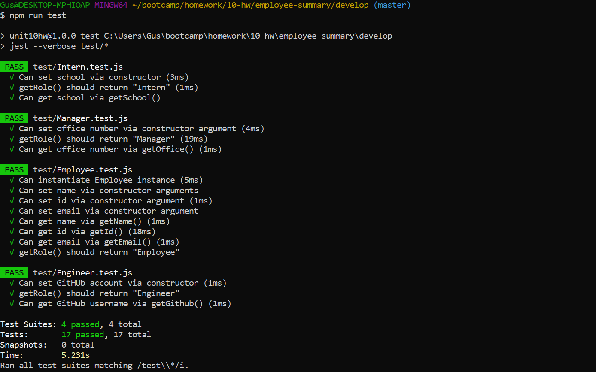
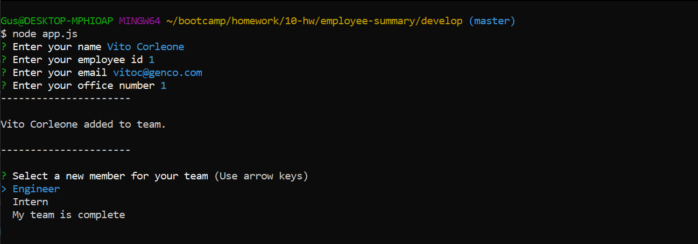
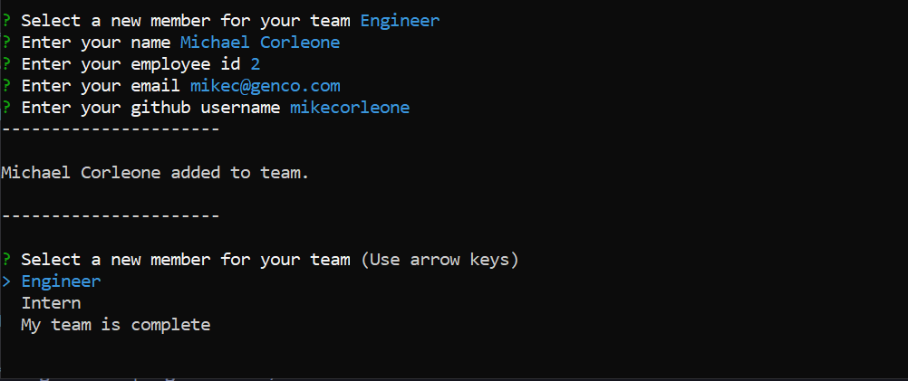
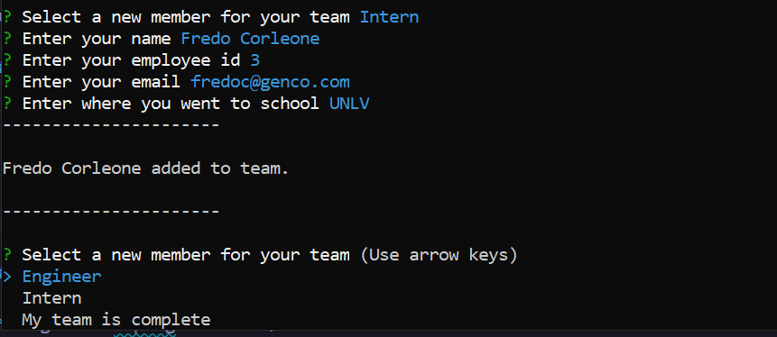
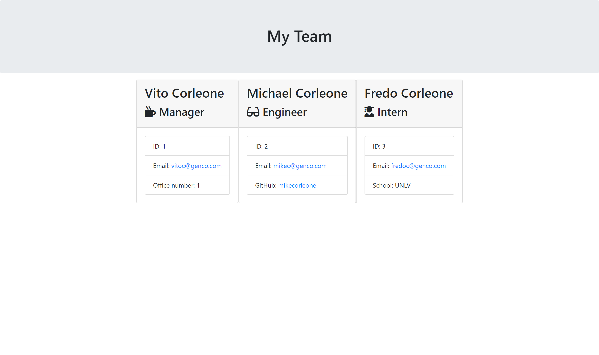

# Employee Summary

## Brief Description
This is a basic CLI application to create and obtain information for a development team using a combination of one manager, and any number of engineers/interns.  Using Node.js and NPM Inquirer a user is prompted a series of commands related to the development team's manager and the team's engineers/interns. Each employee (Manager/Engineer/Intern) require the following data:

* Name
* Employee ID
* Email

However there are unique properties for each employee role that is needed along with other employee properties that were stated above.  This required data is defined as the following:

* MANAGER
    * Office number
* ENGINEER
    * Github username
* INTERN
    * School information

Once a user is satisfied with they development team they have built they have the option to select "My team is complete", which will then generate a folder title "output".  Inside of this folder will contain an HMTL file titled "team.hmtl" and when opened displays the user's created development team and the information associated with each employee.

## Technologies Used

* [JavaScript](https://developer.mozilla.org/en-US/docs/Web/JavaScript) - This application is written and programmed using ES6 JavaScript.

* [Node.js](https://nodejs.org/en/about/) - Used to open, read, and write file(s) on server and return content to client.

* [Git Bash](https://gitforwindows.org/index.html) - Command line tool used to test and get application to function.

* [NPM Inquirer](https://www.npmjs.com/package/inquirer) - NPM package used to prompt user with inputs/questions on the command line.

* [NPM Jest](https://www.npmjs.com/package/inquirer) - NPM package used to test employee parent class and class extensions.

* [HMTL5](https://developer.mozilla.org/en-US/docs/Web/HTML) - Used to give team.html file it's structure and DOM elements.

* [Bootstrap](https://getbootstrap.com/docs/4.4/getting-started/introduction/) - Grid/Column system used to create page layout/structure.  Also used to create and style elements such as jumbotron and cards.

## Tests

## Preview

## Contributors/Authors

* Augustus Heptig - Author/Creator

